# Installing IFORT (Intel FORTRAN) on Linux

## Step 1
Open the terminal and **copy/paste/run** the following two commands to download and install the first part. Then, follow the visual instructions:

`wget https://registrationcenter-download.intel.com/akdlm/IRC_NAS/7deeaac4-f605-4bcf-a81b-ea7531577c61/l_BaseKit_p_2023.1.0.46401_offline.sh`

`sudo sh ./l_BaseKit_p_2023.1.0.46401_offline.sh`

&nbsp;

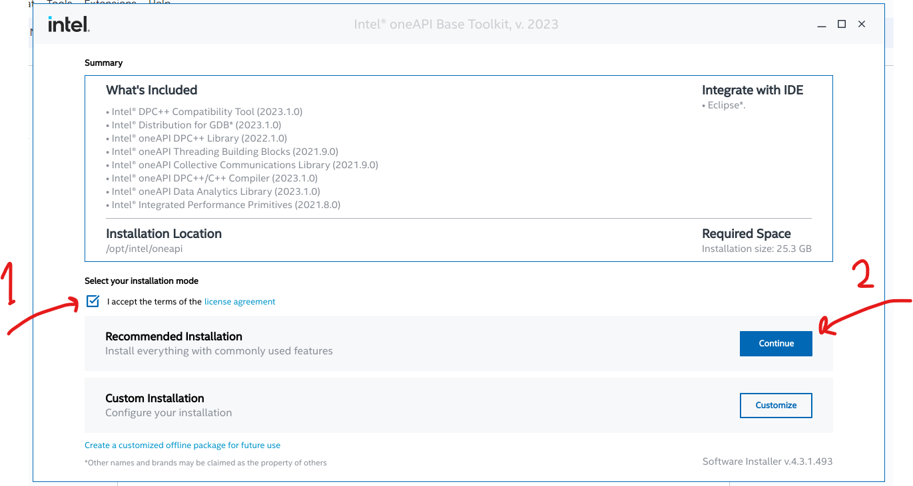
&nbsp;

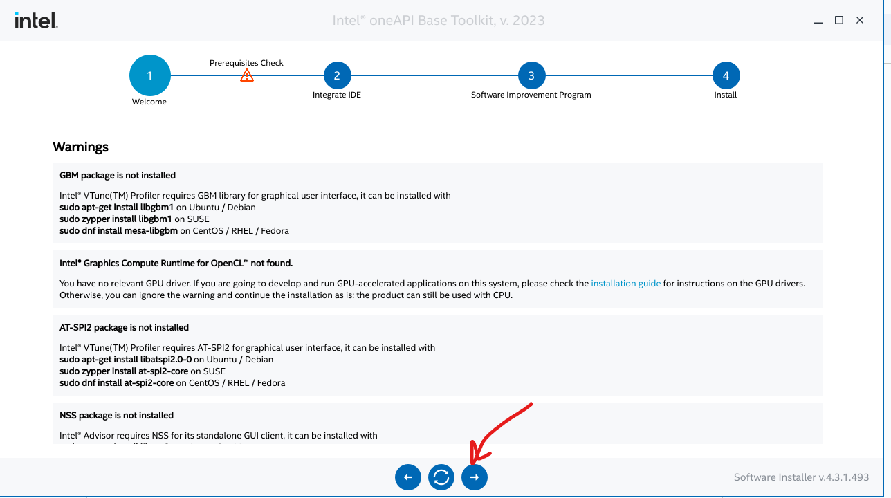
&nbsp;

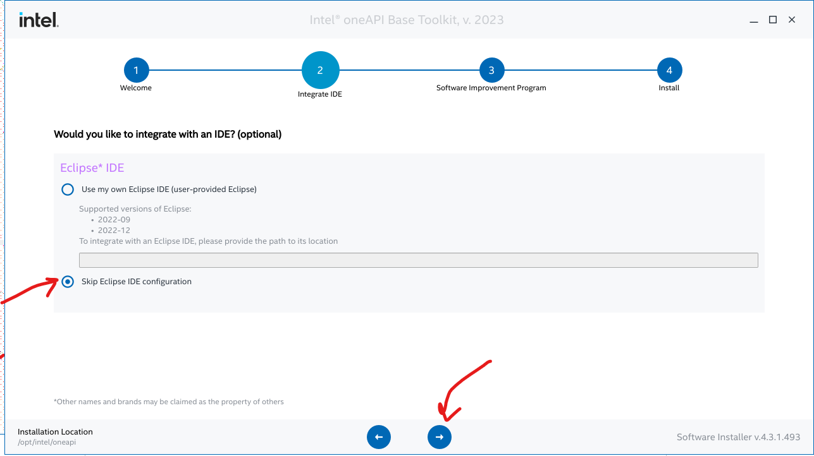
&nbsp;

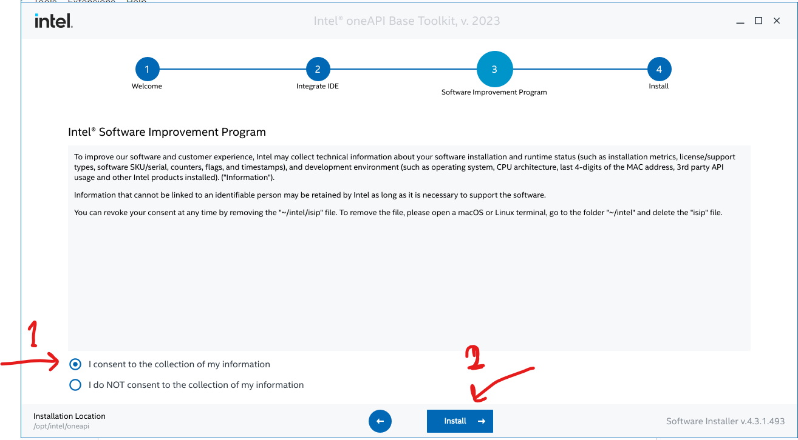
&nbsp;

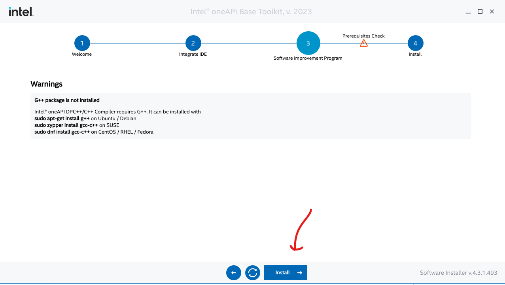
&nbsp;

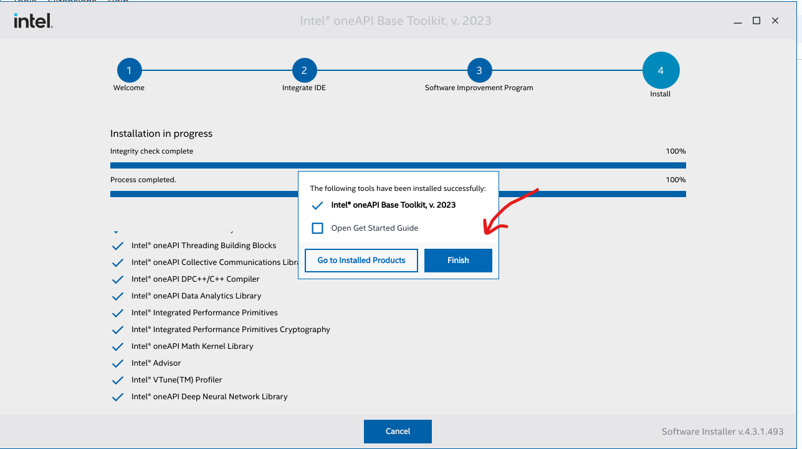
&nbsp;

## Step 2
Open the terminal and **copy/paste/run** the following two commands to download and install the second part. Then, follow the visual instructions:

`wget https://registrationcenter-download.intel.com/akdlm/IRC_NAS/1ff1b38a-8218-4c53-9956-f0b264de35a4/l_HPCKit_p_2023.1.0.46346_offline.sh`

`sudo sh ./l_HPCKit_p_2023.1.0.46346_offline.sh`

&nbsp;

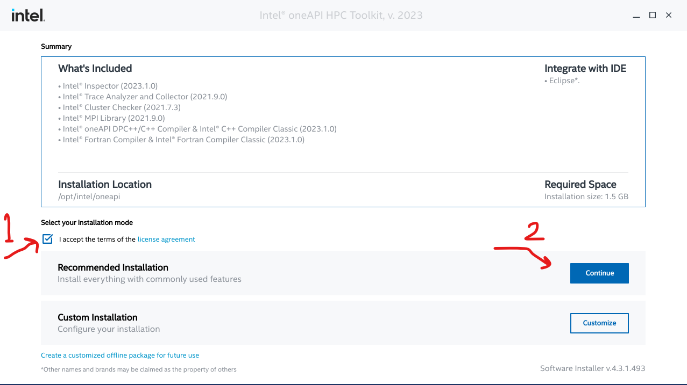
&nbsp;

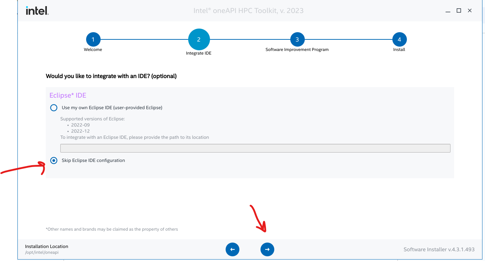
&nbsp;

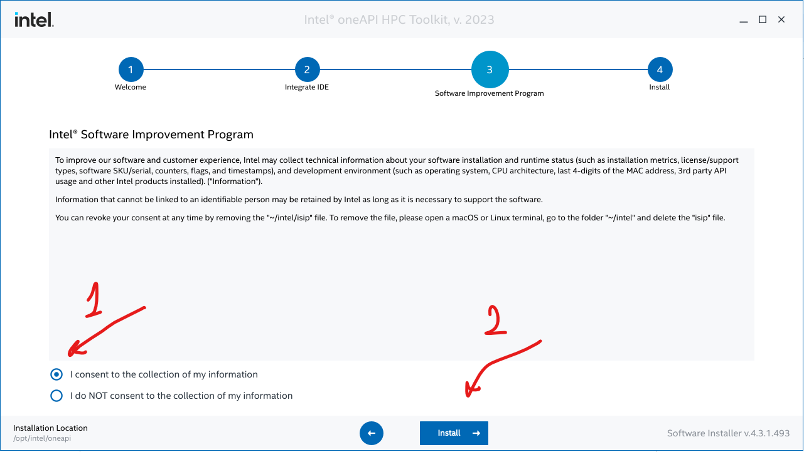
&nbsp;

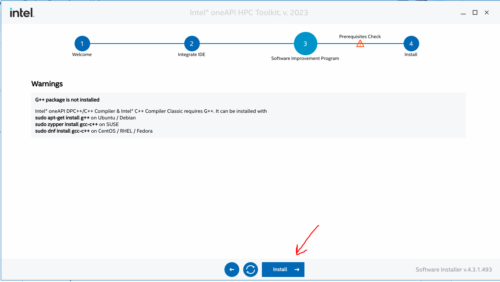
&nbsp;

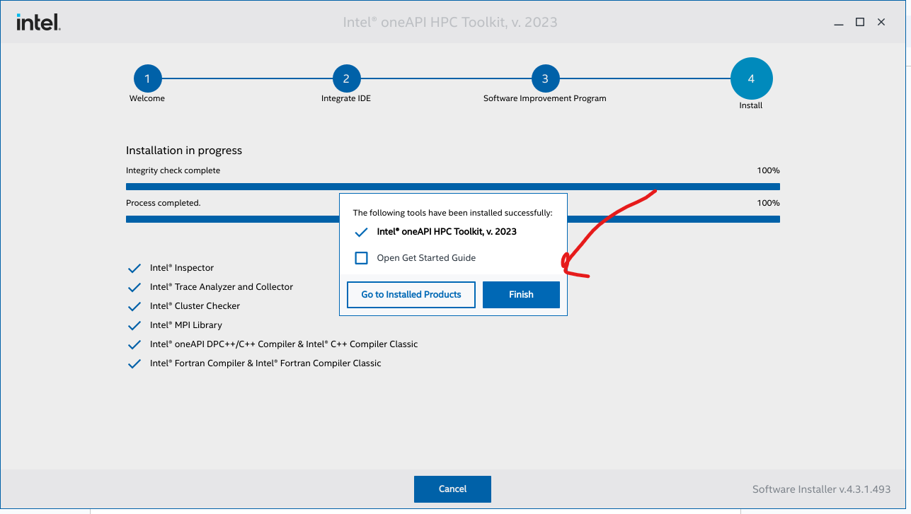
&nbsp;

## Step 3
Install ZSH
- Open WSL terminal

`sudo apt install git zsh -y`

`zsh --version`

`sh -c "$(wget https://raw.githubusercontent.com/ohmyzsh/ohmyzsh/master/tools/install.sh -O -)"`

- Close and reopen the WSL terminal

## Step 4

`nano .zshrc`

Add the bellow path to .zshrc

`source "/opt/intel/oneapi/compiler/2023.1.0/env/vars.sh" intel64`

Like below:

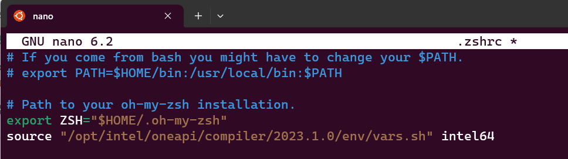
&nbsp;

Close and reopen the terminal and make sure that ifort is installed by this command:

`ifort --version`

## Sources
- Download ifort from Intel website [Link](https://www.intel.com/content/www/us/en/developer/tools/oneapi/base-toolkit-download.html?operatingsystem=linux&distributions=offline&version=2023.1)
- Installation tutorial from Fortran4duck YT Channel [Link](https://www.youtube.com/watch?v=ULR9Esf3sDc)
