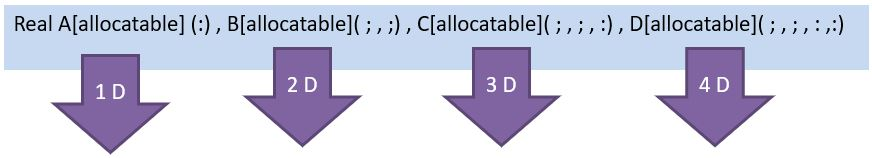
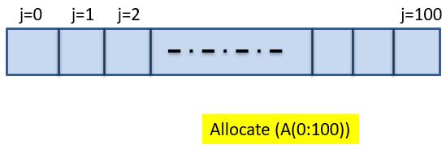
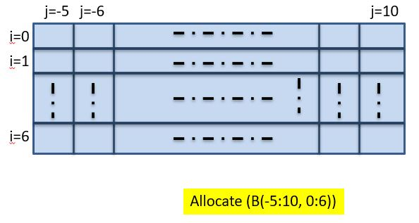
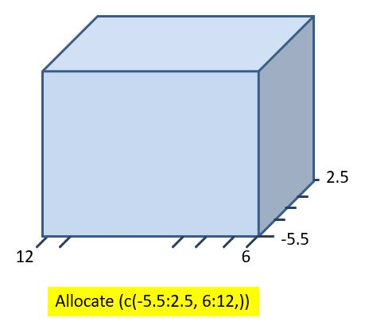
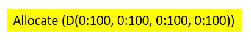

# FORTRAN Main Commands

## Variables
In FORTRAN, variables are classified into four primary types: Integer, Real, Character, and Logical.

```
Integer  i
Real*8   p      ,q        ,r
```

## Arithmetic Operations and Order of Precedence
In FORTRAN, addition, subtraction, multiplication, division, and power operations are performed using the symbols `+`, `-`, `*`, `/`, and `**` respectively.   

The order of operation precedence in FORTRAN is as follows:
1. Calculation of the expression inside the parentheses and library functions
2. Power
3. Multiplication and division
4. Addition and subtraction

## FORTRAN Program Structure
A structure called **General Structure** is suggested for writing programs. 

Note: Older FORTRAN programs typically used the `.For` extension, while newer FORTRAN programs use the `.F90` extension."

## Data Input Methods
- User Data Entry

```
Read(*,*) x
```

- Programmer Data Entry

```
Pi=3.14
```

In FORTRAN, complex numbers are expressed as ordered pairs in the form $𝑍 = 𝑎 + 𝑏𝑖$ represented by `(a, b)`. For example:

```
Ii=(0.,1.)
```

## Program Output
The `Write` command is used to display information on the screen. A comma (`,`) should separate variables that are to be printed.

```
Write(*,*) a,b
```

Note: To print a text phrase, enclose it in quotation marks.

```
Write(*,*)  ‘Result=‘ ,a 
```

To format output in a specific way, a specialized operator can be used in place of the `*` symbol within the Write command.

Key formatting operators include:

- `X`: Inserts a blank space
- `Fw.d`: Outputs a decimal number with a total field length of `W` and `d` decimal places
- `L`: Outputs a logical variable
- `Ew.d`: Outputs a number in scientific notation with a total field length of `W` and `d` decimal places
- `Aw`: Outputs a string with field length `w`
- `Im`: Outputs an integer with field length `m`
- `' '`: Outputs the exact text enclosed in quotation marks
- `/`: Moves the cursor to the next line
- `\`: Keeps the cursor on the same line


```
Write(*, '( operators )' ) outputs
```

`do` command:
- The `do` loop is written as follows:
```
Write(*,*)
Do  i=1,5,2
        Write(*, ‘(a, i2)’ ) ’i=‘ , i 
End  do     !i
```

- `do` and `exit` loop:
```
Write(*,*)
Do
      q=q+1
       write(*, ‘ ( a, f6.2) ’) ‘q=‘ ,q
       if  (q==5)  exit
End do    !i
```
- `do` and `While` loop:
```
Write(*,*)

Do while   (r<5)
       r=r+1
       write(* , ‘(a, f6.2)’) ’r=‘ ,r
End  do !i
```

## Conditional Commands
Using conditional statements, specific sections of the program can be executed based on certain conditions. The basic structure of a conditional command in FORTRAN is:

```
If (a logical expression) executive command
```

A logical expression can represent equality, inequality, or comparison. In FORTRAN, the following symbols are used for conditions:

```
.GE.  or  >=  Greater than or equal to
.GT.  or  >   Greater
.LE.  or  <=  Smaller than or equal to
.LT.  or  <   Smaller
.EQ.  or  ==  Equality
.N.E. or  \=  Inequality
```

Multiple conditions can be combined using the following logical operators:

```
.AND.   The equivalent of "and" means that two conditions are met
.OR.    The equivalent of "or" means that at least one of the conditions is met
.NOT.   It means establishing a condition
```

## Arrays Fundamentals
Arrays in FORTRAN are multidimensional variables, similar to one-dimensional or multi-dimensional matrices. Data can be assigned to arrays based on the indices of their corresponding rows and columns.

To define the dimensions of an array, the following method is used in the variable definition section:



According to the General Structure (GS), the number of entries in each dimension is specified as follows:

One-dimensional (Line):   



Two-dimensional (Plane):   



Three-dimensional (Volume):



Four-dimensions: 

It is important to understand that these titles function like addresses, and from this point onward, they cannot be represented with a simplified image.



Note: The purpose of presenting the above content was to express this fact that the rows can be zero, negative and even decimal, but the step is one for all of them.

## Arrays Operations
Arrays can be used similarly to matrices, allowing for operations such as addition, subtraction, and multiplication.

```
A = B + C    ;     D = A * E
```

**Using arrays**
- Assigning Data Using a Formula, populate array elements based on a specific formula, such as `i*j`:

```
Do  i=1,2
      do  j=1,3
             A(i,j)=i*j
      end do   ! j
End do  ! i
```

- Reading Data from User Input, obtain array values directly from the user:

```
Read(*,*) A(i,j)
```

- Reading Data from a File, retrieve array values from `file 1` to use in subsequent operations:

```
Read(1,*) A(i,j)
```

## Files
When the program’s input data or output results are extensive, a `file` can be used to facilitate reading and writing this information. Data can be stored in a new file using the programming software, allowing for easy saving and retrieval.

To create or read data from a file, use the following command:

```
Open (file number, File='file name')

Read(file number, *) a,b,...
```

The following commands can also be used to print the output on a file:

```
Open (file number, File=' Desired name for the results file')

Write(file number, *) outputs
```

Note 1: Each time the `Read(file number,*)` command is used, one line is read from the file. Using free format, the command automatically advances to the next line after each read. 

To skip a line, use:

```
Read(1,*)
```

Note 2: In the data file, a minimum of one space is required between entries to ensure data separation.

Note 3: Lines in the data file can include explanatory comments for users. These lines are ignored by the program and can be skipped with the following command for each comment line:

```
Read(file number,*)
```

Note 4: The command below can insert results or an empty line in the output file.

```
Write(file number,*)
```

Note 5: The file number is a temporary identifier used to distinguish between files.

Note 6: If there is even a slight mismatch in type (e.g., integer, real, or string) or number of variables between the input file and the variables read by the `Read` command, it may result in errors or inaccuracies in program execution.

### Closing Files
To close a file, use the following command:

```
Close (file number)
```

### Resuming File Read Operations
Use the following command to reset the file pointer to the beginning of a file, allowing its contents to be read again:

```
Rewind (file number)
```

To move the file pointer back to one or more previous lines in the data file, the following command can be repeated as needed:

```
Backspace (file number)
```

## Built-in Library Functions
FORTRAN provides a variety of built-in functions to simplify programming, which can be utilized simply by referencing their names.

| Function | Description | 
|--------|--------| 
| ABS(a) | It calculates the absolute value of the number `a`. |  
| AINT(a) | It removes the decimal part of the number `a`, but the result remains a real number. |  
| ANINT(a) | It rounds the real number `a` to the nearest integer. |  
| NINT(a) | Rounds the real number `a` and the result will be an integer number (by removing the decimal point). | 
| INT(a) | It converts the real number `a` into an integer by removing its decimal part. |  
| Real(N) | Converts integer `N` to real type. Using this, the number `N` can be received as a decimal. | 
| SIN(a), COS(a), TAN, COTAN(a) | They calculate the sine, cosine, tangent and cotangent of the number `a` respectively. |  
| ASIN(a), ACOS(a), TAN, ATAN(a) | They calculate the inverse of sine, cosine, tangent and cotangent of the number `a`. | 
| SINH(a), COSH(a), TANH(a) | They calculate the sine, cosine, and hyperbolic tangent of the number `a`, respectively. |  
| EXP(a)| Equivalent to $e^{a}$. | 
| LOG(a) | Equivalent to `Ln(a)`. |  
| Log10(a) | Equivalent to `Log(a)`. |  
| SQRT(a) | It is equivalent to $\sqrt{a}$ , Explanation: To calculate the $n_{th}$ root of a number, you should write $a^{\frac{1}{n}}$ |
| MAX(a,b,…) | The result of this function will be the maximum number of its input. |  
| MIN(a,b,…) | The result of this function will be the minimum of its input numbers. |  
| MOD(a,b) | Calculates the remainder of the correct division of `a` by `b`. |  
| CALL RANDOM(a) | Assigns a random value between 0 and 1 to the number `a`. |  
| CALL GETTIM (Ih,Im,Is,I100th) | Receives the time with an accuracy of hundredths of a second. After executing this command, $I_h$, $I_m$, $I_s$, and $I_{100th}$ are respectively equal to hours (1 to 24), minutes, seconds, and hundredths of seconds (in the form of whole numbers). |  
| CALL SETTIM (Ih,Im,Is,I100th) | If the correct variables $I_h$, $I_m$, $I_s$, and $I_{100th}$ have values, they record the new time. |  
| GETDAT (Iyr, Imon, Iday) | After executing this command, the year, month, and day will be recorded in the $I_{yr}$, $I_{mon}$, and $I_{day}$ variables. |   
| SETDAT (Iyr, Imon, Iday) | The new year, month and day values will be recorded on the device. |  


## Defining Custom Functions
To perform calculations or operations not available in FORTRAN, custom functions can be defined and used in two ways:

1. Defining a One-Sentence Function: The simplest way to define a function is by writing the corresponding expression directly after non-executable statements (such as Integer, Data, etc.) and before executable commands (such as `Read`). It is recommended to give the function a name that does not overlap with any built-in FORTRAN functions.

```
Real a,b,c
F(x,y,z)=(x+y+z)**2
Read(*,*)a,b,c
Write(*,*)f(a,b,c)
end
```

Note: In this example, the variable names in the function are significant only in their positional order, meaning renaming them will not affect the function's application.

2. Defining a Function using the `Function` command: For more complex functions, it is preferable to define them with the `Function` command. The function is written as a separate block after the main program, and it is called in the main program simply by its name.

```
Read(*,*)a,b,c
Write(*,*)f(a,b,c)
end
```

```
Function F(x,y,z)
C1=(x+y)**2
C2=(x+z)**2
C3=(y+z)**2
F=(c1+c2+c3)**2
end
```

Note: When calling the function in the main program, use only the function name without its arguments. Writing `F(x, y, z)` instead of `F` will result in an error.

## Best Practices for Programming

- Incremental Sum:  
To incrementally add a series of values, use an approach similar to the following example:

```
Sum=0
Do i=1,n
     sum=sum+A(i)
End do
```

- Successive Multiplication:   
For successive multiplication of a series of values, use the following method:

```
P=1
Do    i=1,n
         p=p*A(i)
End do
```

- Character Data Concatenation:  
Character variables can be assigned expressions either through the `Read` command or with the `=` operator. To concatenate two or more character variables (or values), use the `//` operator.

```
Character name1*10, name2*10, text*20
Name1=‘Carl’
Name2=‘Taylor’
Text=name1//name2
Write(*,*)text
```

Output:

```
Carl      Taylor
```

If you want to remove the extra spaces in a character variable, leaving only the occupied characters, use the `Trim` command. In the example above, if the `Text` variable is defined as follows, the output will display with only one space between the two words.

```
Text=trim(name1)//’ ‘//trim(name2)
```

Output:

```
Carl Taylor
```
